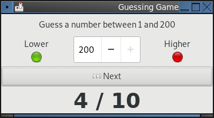
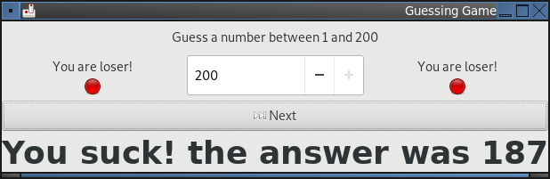
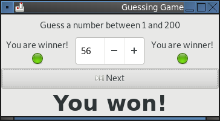
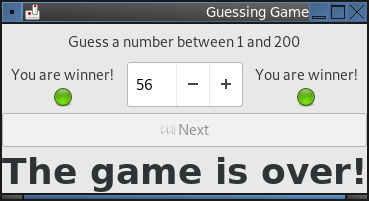

# guessgame
An amazing guessing number game written in python. Honestly I don't know why anyone plays anything else? PUBG? More like guessgame

## Screenshots
### Before playing

### You guessed too low

### You guessed too high

### You lost

### You won

### You kept clicking next for some reason

## Install

1. If you are running Gnome or Unity on Linux with Python 3, you should be able to open
a terminal and type python guessgame.py and have it work without any issues.

2. If you are running Windows, you will need to download and run [this installer](https://sourceforge.net/projects/pygobjectwin32/files/pygi-aio-3.24.1_rev1-setup_049a323fe25432b10f7e9f543b74598d4be74a39.exe/download) before running it in the same way as above.

## Development

To edit the user interface:

1. Download and install the Glade development tool
2. Run Glade
3. Open the guessinggame.glade file
4. Change things
5. Save it.
6. Edit the Python script.
7. Run it.
